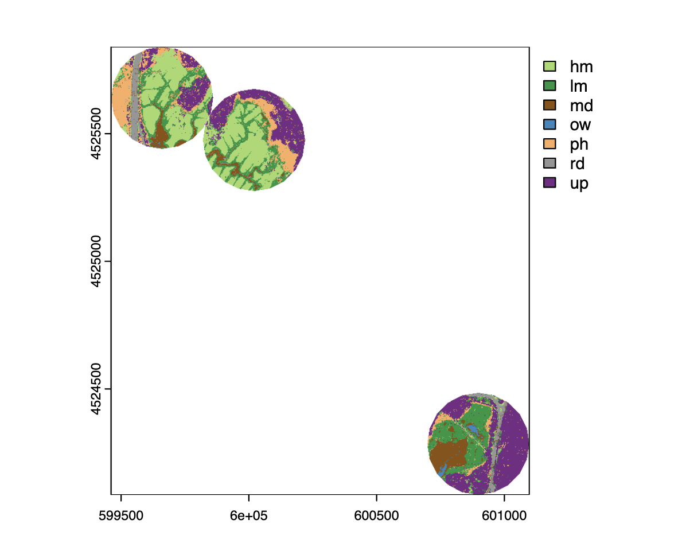

# Tidal Marsh Bird Project

This project is a community ecology study on the relationship between secretive marsh birds and their habitats.

## TODO 
1. classify marsh habitat :white_check_mark:
2. extrapolate to study plots :white_check_mark:
3. model species richness
4. model abundance
5. model presence/absence
6. results

## Update
I successfully classified 3 of my plots (proof of concept :white_check_mark:)! I am currently working on improving model accuracy and checking validation metrics.

