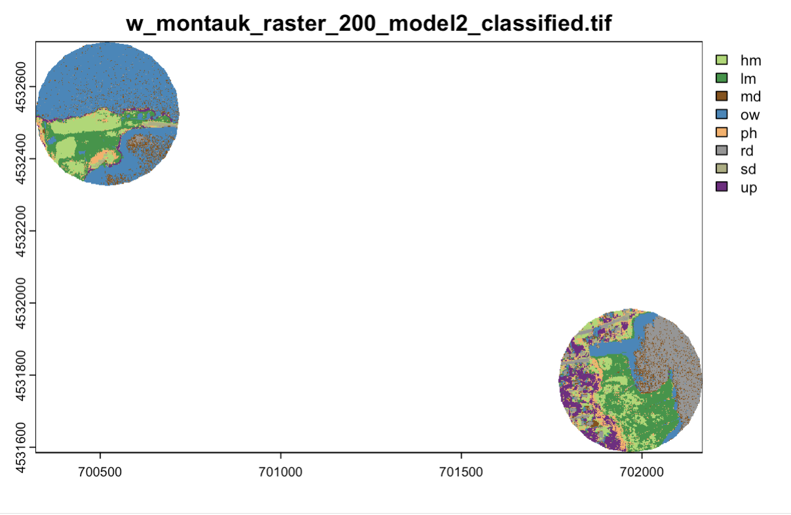
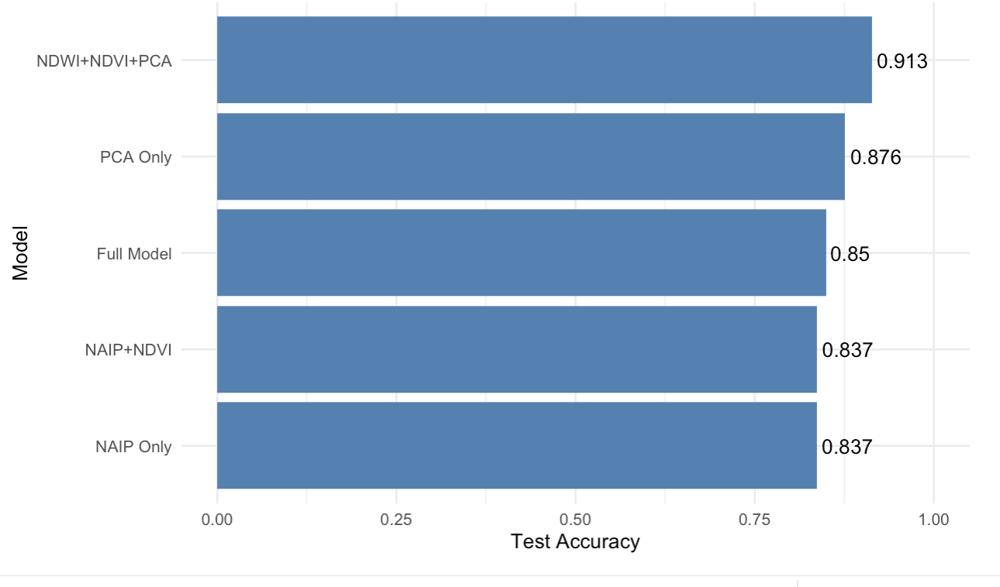
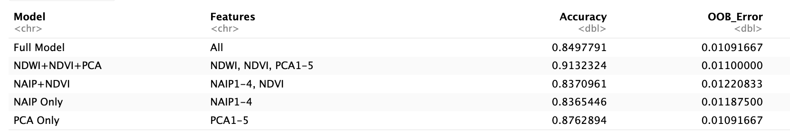

# Tidal Marsh Bird Project

My goal is to use habitat + survey data data to identify relationships between tidal marsh birds and their habitats. 

## TODO 
1. classify marsh habitat :white_check_mark:
2. extrapolate to study plots :white_check_mark:
3. model presence/absence :white_check_mark:
4. model total_count :white_check_mark:
5. model species richness (potential analysis)
6. model abundance (potential analysis)

## Update
2026-03-04: I successfully classified the rasters, and was able to run spOccupancy model on presence/ absence data for CLRA, SALS, & SESP. 
Additionally, I ran a negative binomial GLM on total count. For next steps, I will be evaluating model results and running additional checks. Stay tuned!

